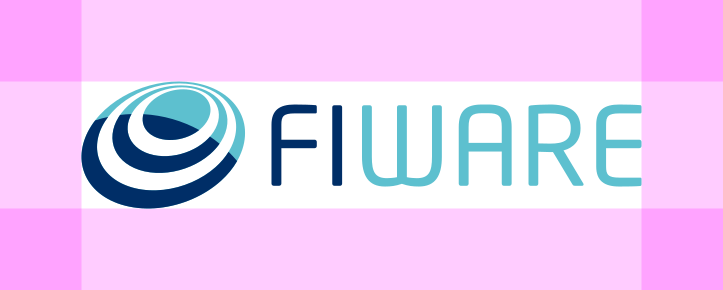

# FIWARE Logo

Lorem ipsum dolor sit amet, consectetuer adipiscing elit. Aenean commodo ligula eget dolor. Aenean massa. Cum sociis natoque penatibus et magnis dis parturient montes, nascetur ridiculus mus. Donec quam felis, ultricies nec, pellentesque eu, pretium quis, sem. Nulla consequat massa quis enim. Donec pede justo, fringilla vel, aliquet nec, vulputate eget, arcu.

## Main Logo
<h4>Color</h4>

    

        <h4>Black</h4>
        
    

    

        <h4>White</h4>
        
    

    

        <h4>Monochrome</h4>
        
    

Logo Usage

Lorem ipsum dolor sit amet, consectetuer adipiscing elit. Aenean commodo ligula eget dolor. Aenean massa. Cum sociis natoque penatibus et magnis dis parturient montes, nascetur ridiculus mus.

    

        <h3>Clear Space</h3>
        
        
All versions of our logo have exclusion zones around them to help them stand out.

        
The exclusion zone is equal to the height of letter A.

    

    

        <h3>Minimum Sizes</h3>
        

            

                <h4>Digital</h4>
                
                
75px

            

            

                <h4>Print</h4>
                
                
20mm

            

        

    

<h3>Dont’s</h3>

    

        <h4>01</h4>
        
    

    

        <h4>02</h4>
        
    

    

        <h4>03</h4>
        
    

## Full Logo

Lorem ipsum dolor sit amet, consectetuer adipiscing elit. Aenean commodo ligula eget dolor. Aenean massa. Cum sociis natoque penatibus et magnis dis parturient montes, nascetur ridiculus mus. Donec quam felis, ultricies nec, pellentesque eu, pretium quis, sem. Nulla consequat massa quis enim. Donec pede justo, fringilla vel, aliquet nec, vulputate eget, arcu.

## Secondary Logo

<h4>Color</h4>

    

        <h4>Black</h4>
        
    

    

        <h4>White</h4>
        
    

    

        <h4>Monochrome</h4>
        
    

Lorem ipsum dolor sit amet, consectetuer adipiscing elit. Aenean commodo ligula eget dolor. Aenean massa. Cum sociis natoque penatibus et magnis dis parturient montes, nascetur ridiculus mus. Donec quam felis, ultricies nec, pellentesque eu, pretium quis, sem. Nulla consequat massa quis enim. Donec pede justo, fringilla vel, aliquet nec, vulputate eget, arcu.